# Логическая архитектура инвестиционного приложения

Документ фиксирует логическую архитектуру персонального инвестиционного приложения на Python с T-Bank Invest API: подходы к декомпозиции, акторов, workflows, компоненты, сценарии и их связи.

---

## 1. Подходы к декомпозиции

Используются два взаимодополняющих подхода.

**Workflow-based (по рабочим процессам)**
Смотрим на приложение как на поток данных: что происходит от входа до полезного результата. Компоненты = этапы обработки. Хорошо ложится на техническую декомпозицию и пайплайны.

**Actor-based (по авторам действия)**
Смотрим, кто инициирует действия и в чьих интересах. Компоненты = границы ответственности перед действующим лицом. Хорошо ложится на распределение ролей и контракты.

Оба подхода дают разные, но дополняющие картинки. Workflow отвечает на вопрос «какие шаги», actor — «кто их запускает».

---

## 2. Акторы и источники

### 2.1. Различие

**Актор** — тот, кто инициирует действия и имеет интерес в результате.  
**Источник данных** — тот, кто пассивно отдаёт данные, но ничего не инициирует.

### 2.2. Акторы

| Актор | Что инициирует | Интерес |
|---|---|---|
| **Пользователь** | Просмотр, настройка правил, подтверждение сделок, kill switch | Понятная картина портфеля |
| **Оператор** | Backfill, миграции, расписание, ротация токенов, восстановление БД | Работоспособность системы |
| **Планировщик** | Действия по расписанию: снимки, обновление котировок, пересчёт метрик | Свежесть данных |
| **Робот-исполнитель** | Расчёт сигналов, проверка лимитов, выставление ордеров | Исполнение стратегии по правилам |

Пользователь и Оператор — **один человек в двух ролях**. В коде: общее ядро, разные интерфейсы (бот/веб — для пользователя, CLI — для оператора).

Планировщик и Робот — две ветви актора «Система». Разделение принципиально: у них разные последствия ошибок. Ошибка планировщика → устаревшие данные. Ошибка робота → реальные деньги.

### 2.3. Источники (не акторы)

| Источник | Что отдаёт |
|---|---|
| **Брокер (T-Bank Invest API)** | Операции, котировки, приём заявок |
| **Внешние данные** | Курсы валют, индексы, бенчмарки |

С источниками работаем через **контракты интеграции**, не через user stories.

### 2.4. Роли Пользователя и Оператора

| Сценарий | Пользователь | Оператор |
|---|---|---|
| Смотрит портфель | да | да |
| Настраивает целевые доли | да | да |
| Запускает backfill | нет | да |
| Меняет схему БД / миграции | нет | да |
| Настраивает расписание | нет | да |
| Ротирует токены API | нет | да |
| Включает / выключает торговлю | нет | да |
| Восстанавливает БД из бэкапа | нет | да |
| Kill switch | да | да |

Админские сценарии реализуются через **CLI**, а не через бот или веб.

---

## 3. Workflows (рабочие процессы)

Список рабочих процессов, разделённый по категориям.

### 3.1. Интерфейсные процессы

- Выбор действия пользователя (CLI / веб / команды в чате)
- Отображение портфеля (графики, диаграммы)
- Уведомление в чат
- Подтверждение сделки в чате

### 3.2. Сквозные механизмы (инфраструктура)

- Расписание обращений к API
- Кэширование котировок

Не производят ценность для пользователя напрямую, но без них приложение не работает.

### 3.3. Доменные процессы

- Получение сырых данных по API T-Bank
- Сохранение данных в БД
- Реконструкция состава портфеля на дату
- Расчёт FIFO сделок по тикеру
- Расчёт стратегии
- Проверка лимитов
- Выставление ордеров

### 3.4. Упорядоченный список (от источника до пользователя)

**Слой данных**
1. Получение сырых данных по API T-Bank
2. Кэширование котировок
3. Сохранение данных в БД

**Доменный слой**
4. Реконструкция состава портфеля на дату
5. Расчёт FIFO сделок по тикеру
6. Расчёт стратегии
7. Проверка лимитов
8. Выставление ордеров

**Интерфейсный слой**
9. Выбор действия пользователя (CLI / веб / чат)
10. Отображение портфеля
11. Уведомление и подтверждение сделки в чате

**Сквозные механизмы**
12. Расписание обращений к API

### 3.5. Важные уточнения

- **«Проверка лимитов» и «выставление ордеров» — два разных процесса.** Первый — решение, второй — действие. Слияние позволяет роботу обойти лимиты.
- **«Расписание» и «кэширование» — не доменные процессы, а инфраструктура.**
- **«Подтверждение сделки» — не уведомление.** Уведомление одностороннее (бот → человек), подтверждение двустороннее (бот ↔ человек ↔ Risk → Executor).

---

## 4. Базовый компонент

### 4.1. Критерии базовости

Компонент базовый, если удовлетворяет всем трём:

1. На него ссылаются все, а он — ни на кого в доменной логике.
2. Он хранит состояние, без которого остальные не работают.
3. Если его убрать, приложение теряет смысл.

### 4.2. Применение к компонентам

- **Market Data Adapter** — граница, не базовый.
- **Portfolio Store (БД)** — читается всеми, ни от кого в домене не зависит. **Кандидат.**
- **Portfolio Model** — строится из Store. Производный.
- **Analytics, Tax, Decision, Execution** — зависят от Store/Model. Не базовые.

### 4.3. Вывод

**Базовый компонент — Portfolio Store.** Нормализованное хранилище операций, позиций, снимков и цен.

Первым производным слоем является **Portfolio Model** — состояние портфеля на дату.

Как компоненты ложатся на фактическую структуру кода — в 5.4.

---

## 5. Логические компоненты

### 5.1. Таблица компонентов

| Workflow | Компонент | Тип |
|---|---|---|
| Получение данных | Market Data Adapter | граница |
| Кэш котировок | Quote Cache | инфраструктура |
| Сохранение в БД | Portfolio Store | **базовый** |
| Реконструкция | Portfolio Model | производный |
| FIFO | Tax Engine | доменный |
| Стратегия | Strategy Engine | доменный |
| Проверка лимитов | Risk Manager | доменный |
| Выставление ордеров | Trade Executor | доменный (пишет в API) |
| Выбор действия | CLI / Bot / Web | интерфейс |
| Отображение | Presenter (внутри интерфейса) | интерфейс |
| Уведомление | Notification Service | сервис |
| Подтверждение сделки | Confirm Handler | сервис |
| Расписание | Scheduler | инфраструктура |

### 5.2. Граф зависимостей

```
Интерфейсы:   CLI  |  Bot  |  Web
                ▲      ▲       ▲
                │      │       │
Сервисы:    Notification   Scheduler
                ▲              ▲
                │              │
Доменные:   Strategy → Risk → Executor
                ▲
                │
            Portfolio Model ← Tax Engine
                ▲
                │
            Portfolio Store  ◄── БАЗОВЫЙ
                ▲
                │
         Quote Cache
                ▲
                │
        Market Data Adapter
                ▲
                │
          T-Bank API
```

**Правила:**
- Зависимости только снизу вверх.
- Никакой движок не знает про интерфейсы.
- Executor — единственный, кто пишет в API (кроме Adapter’а для чтения).
- Risk стоит между Strategy и Executor — не даёт обойти лимиты.

### 5.3. Контракты компонентов (черновик)

- **Portfolio Store** — `save_operations`, `get_positions(date)`, `save_snapshot`.
- **Portfolio Model** — `reconstruct(date) -> PortfolioState`.
- **Tax Engine** — `fifo(ticker) -> list[Lot]`, `matured_lots(date) -> list[Lot]`.
- **Risk Manager** — `check(order) -> Allow | Reject(reason)`.
- **Trade Executor** — `place(order) -> OrderId` (на старте только sandbox).

### 5.4. Соответствие компонентов структуре кода

Компоненты логические, а не файловые. Имена модулей подчиняются фактической структуре `src/`, а не схеме `core/` из `PROJECT_PLAN.md` 7.3.

| Компонент | Где в коде | Статус |
|---|---|---|
| Market Data Adapter | `src/t_api/` | есть |
| Portfolio Store | `src/db/` | создать |
| Quote Cache | `src/db/quote_cache.py` | создать |
| Portfolio Model | `src/services/portfolio_service.py` | создать |
| Tax Engine | `src/services/tax_service.py` | создать |
| Strategy Engine | `src/services/strategy_service.py` | создать |
| Risk Manager | `src/services/risk_service.py` | создать |
| Trade Executor | `src/services/executor_service.py` | создать |
| Trade Journal | `src/services/journal_service.py` | создать |
| Notification Service | `src/services/notification_service.py` | создать |
| Confirm Handler | `src/services/confirm_service.py` | создать |
| Scheduler | `src/services/scheduler_service.py` | создать |
| Presenter | внутри интерфейса, в ядро не импортируется | создать |
| CLI / Bot / Web | `cli.py`, `bot.py`, `dashboard.py` | создать |
| DTO и значения | `src/models/` | есть |
| Конфиг: токены, расписание, целевые доли, мессенджер | `src/config.py` | есть |

Правила:

- Доменные компоненты — по одному модулю в `src/services/`, стиль имён как у существующего `account_service.py`.
- `src/models/` — только DTO и значения, без обращений в API и в БД.
- Ядро (`src/`) не импортирует `cli.py`, `bot.py`, `dashboard.py`.
- `main.py` остаётся точкой входа для ручных прогонов, новые интерфейсы — отдельные файлы.

### 5.5. MVP: базовые компоненты

Первый этап — это 2.1 MVP («пульт портфеля») за вычетом того, что вынесено за скобки. Каждая диаграмма ниже показывает один срез и читается независимо от остальных.

**Исключено из рассмотрения:**

| Что | Компоненты | Причина |
|---|---|---|
| Стратегии и сделки | Strategy Engine, Risk Manager, Trade Executor, Trade Journal, Confirm Handler | Этап 2.3 |
| Уведомления в чат | Notification Service, Confirm Handler | Вне первого контура |
| Веб-интерфейс | Web | 2.5: сложный веб не делаем |
| Расписание | Scheduler | Ручной запуск из CLI |

В интерфейсе первого этапа остаётся только CLI: бот существует ради уведомлений и подтверждений, оба вне контура.

**Контур данных.** Один проход слева направо, от брокера до экрана.

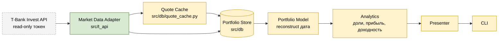

Зелёное — уже есть в репозитории, жёлтое — создавать. Adapter пишет в Store и котировки, и операции; Quote Cache стоит на пути котировок, чтобы не перекачивать их на каждый запрос.

**Слои и зависимости.** Тот же контур, но сгруппирован по слоям 5.2. Стрелка направлена от того, от кого зависят.

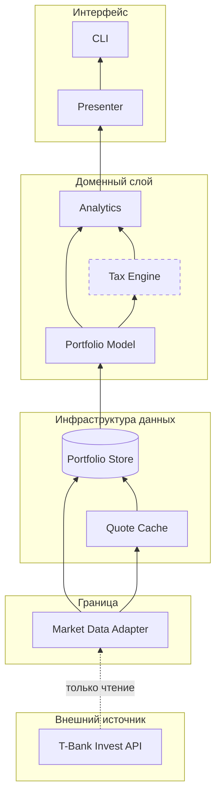

- Зависимости только снизу вверх: домен не знает про Presenter и CLI.
- **Portfolio Store — базовый компонент** (4.3): читают все, от домена не зависит ни от кого.
- **Tax Engine показан пунктирной границей этапа** — FIFO относится к 2.4, а не к 2.1. В контуре он держится на Model и нужен, только если на первом этапе считать налоговые лоты. Решение за тобой.
- Analytics в таблице 5.1 отсутствует как строка, но метрики 2.1 (доли, прибыль, доходность) — это он и есть, и в 8.5 он присутствует как узел. Расхождение 5.1 и 8.5 стоит закрыть: либо добавить Analytics в 5.1, либо убрать из 8.5.

**Порядок сборки.** Что за чем, по зависимостям, а не по важности фич.

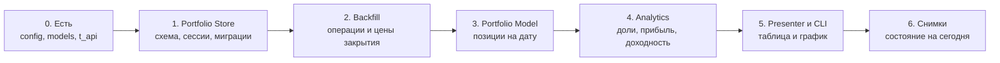

Пункт 6 после вывода: без истории на экране приложение уже полезно, а снимки копят историю только вперёд — задним числом вчерашний день не восстановить. Поэтому начинать их надо как можно раньше: разрыв между 5 и 6 это потерянные дни графика.

**Границы модулей в коде.** Как контур раскладывается по `src/` и кто кого импортирует.

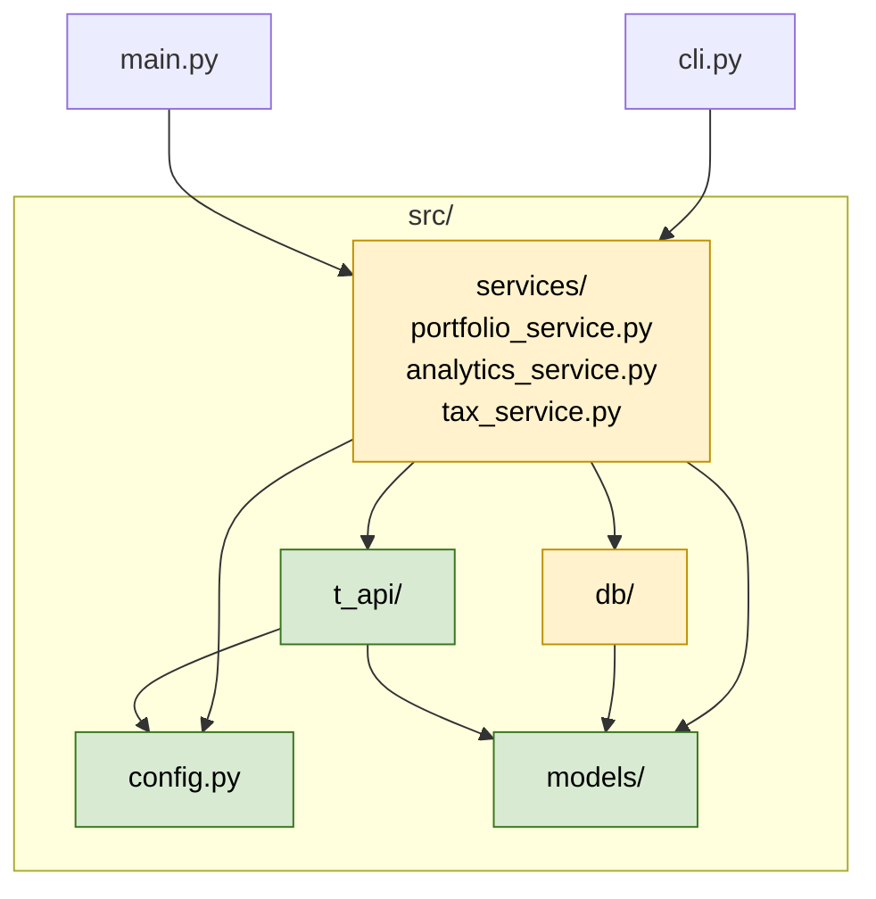

Три правила из 5.4 на этом срезе: `models/` не импортирует ни `db/`, ни `t_api/`; `src/` не импортирует `cli.py`; `db/` и `t_api/` не знают друг про друга — встречаются только внутри `services/`.

**Рантайм: два сценария.** Разовый backfill и обычный запрос пользователя.

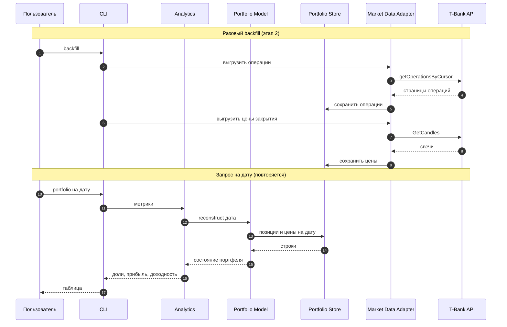

Backfill обращается к API, запрос на дату — нет. Это и есть цель контура: после загрузки история строится из локальной БД и не упирается в rate limit.

**Что меняется из-за исключений.** Не замечания по оформлению, а последствия для скоупа:

- **Без Scheduler** ежедневный снимок и обновление котировок запускает человек из CLI или cron ОС. Пункт 2.1 «отчёт раз в день/неделю» и П3 из 6.3 без расписания не выполняются сами.
- **Без Notification Service** в 2.1 нереализуемы три пункта уведомлений (цена выше/ниже, изменение за день, периодический отчёт). Это противоречие со списком MVP — если уведомления действительно сдвигаются, их надо убрать из `PROJECT_PLAN.md` 2.1.
- **Без Web** «График стоимости портфеля» из 2.1 существует только как файл (PNG/HTML) или ASCII в терминале — Presenter отдаёт данные, рисует не браузер.

### 5.6. Корзины компонентов MVP

Одна корзина = один компонент. Внутри корзины два отсека: **обязанности** (что компонент делает) и **истории** (какие user stories он закрывает). Ребро читается как «обязанность нужна, чтобы закрыть историю».

Два правила чтения:

- **Обязанность без ребра** — в скоупе есть работа без пользовательской ценности. Либо это техническая необходимость, либо лишнее.
- **История без ребра** — корзину строить не из чего, контракт не определён.

#### Корзина 1. Portfolio Store — базовый

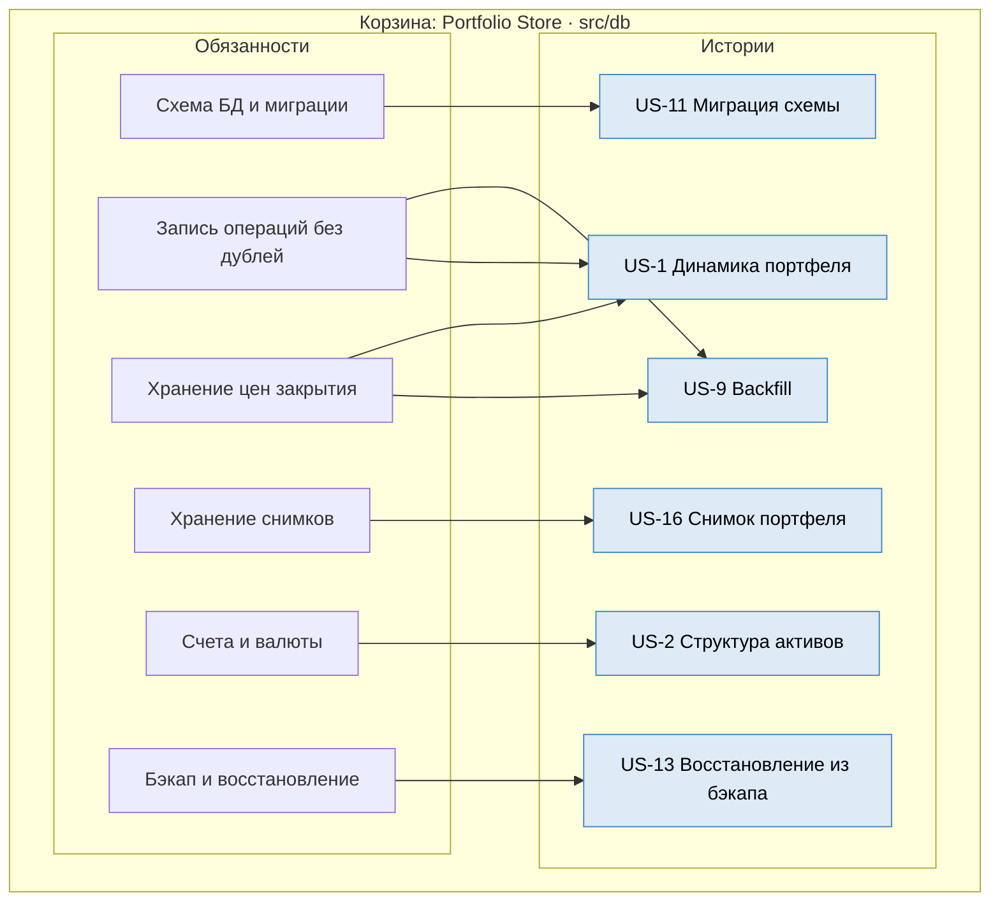

Контракт 5.3: `save_operations`, `get_positions(date)`, `save_snapshot`. Обязанность R12 берёт на себя AC «повторный запуск не создаёт дублей» из US-9 — по 4.1 `operation_id` неустойчив, поэтому перезапись идемпотентная, а не вставка.

#### Корзина 2. Portfolio Model

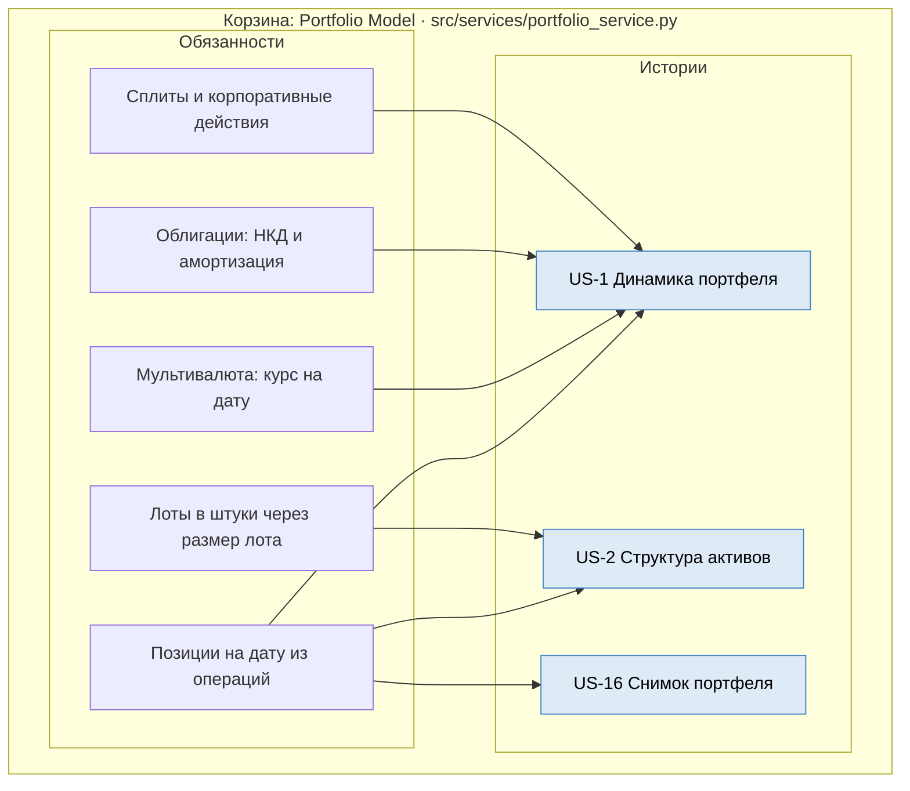

R24 и R25 — это «подводные камни» из `PROJECT_PLAN.md` 3.5. Если в MVP портфель только из акций, обе обязанности выносятся за скобки, и корзина сжимается до трёх.

#### Корзина 3. Market Data Adapter — граница

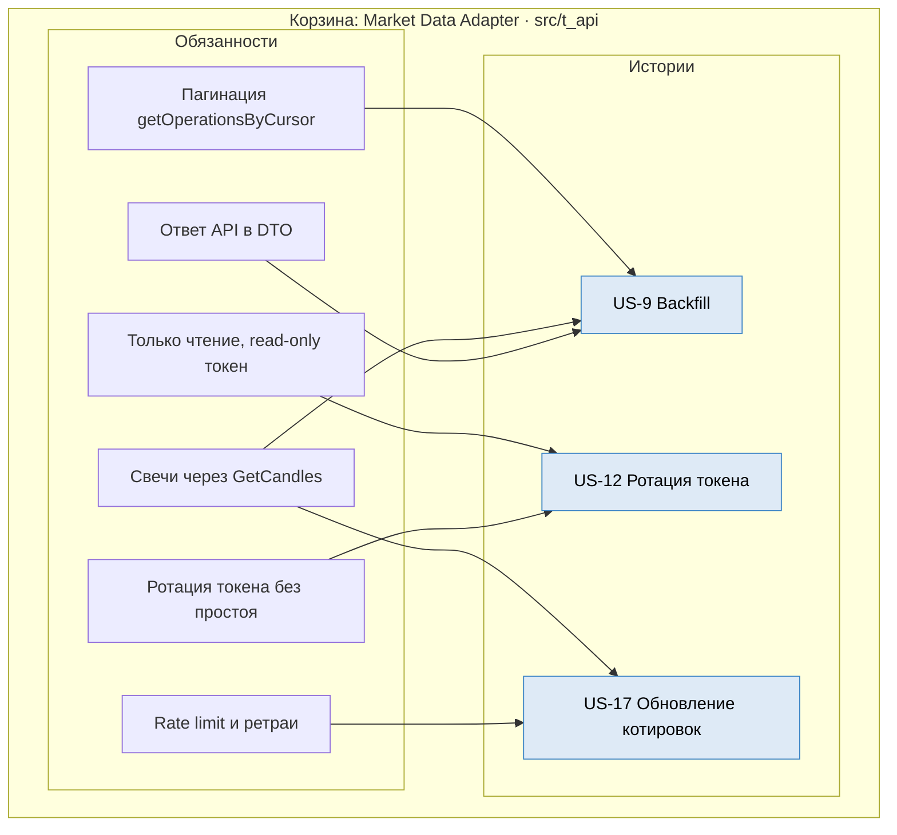

Правило 3 из 10: компонент только читает. Запись в API появится вместе с Trade Executor, то есть не в MVP. R35 существует, чтобы протокол не протекал в домен: `models/` не знает про protobuf.

#### Корзина 4. Quote Cache

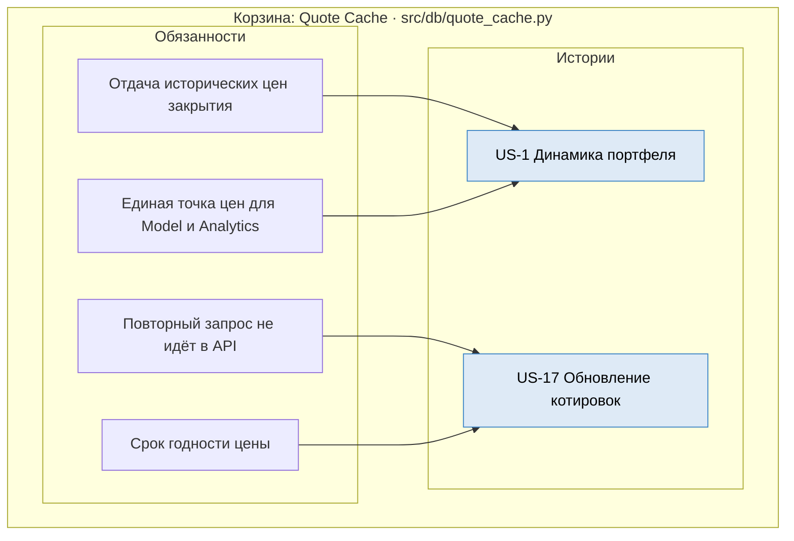

Самая маленькая корзина. Если её убрать, R41 и R42 переедут в Adapter, и граница «адаптер = протокол» размоется.

#### Корзина 5. Analytics

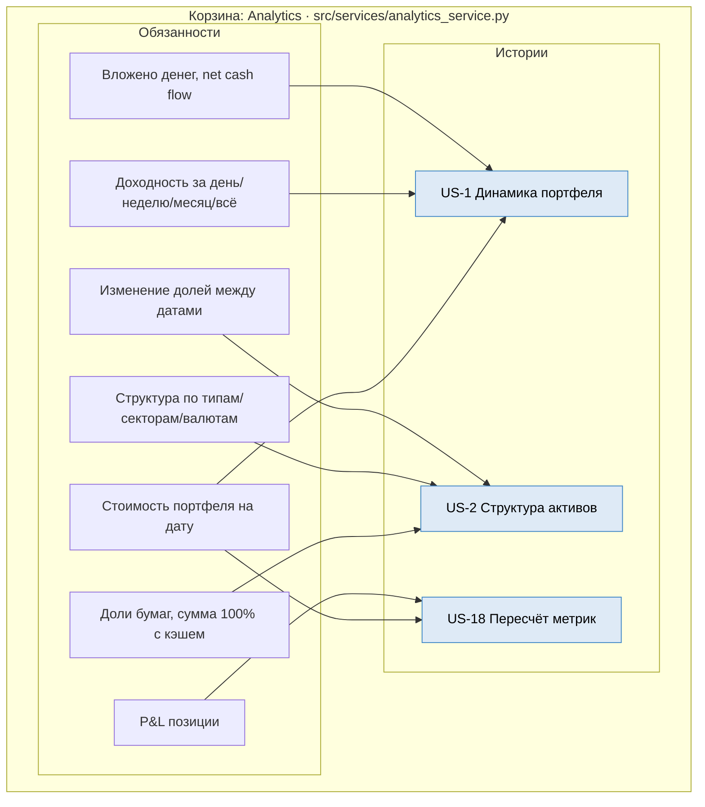

R55 закрывает AC «две линии: стоимость и вложенные средства» из US-1. XIRR, TWR, Sharpe и просадка в корзину не входят — это 2.2.

Компонента нет в таблице 5.1, но без него не закрывается ни одна история Пользователя. См. замечание в 5.5.

#### Корзина 6. CLI и Presenter — интерфейс

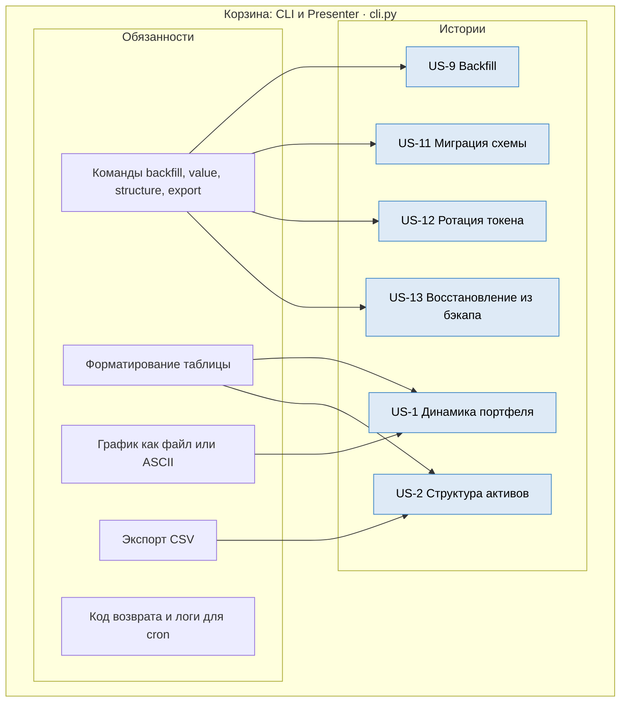

R65 — единственная обязанность без ребра: она нужна оператору, который запускает задачи из cron ОС вместо Scheduler, но отдельной истории под неё нет.

#### Корзина 7. Config — сквозной

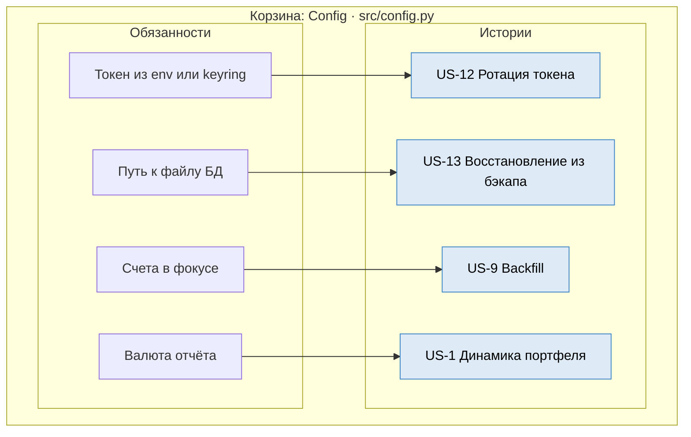

Расписание и выбор мессенджера в конфиге остаются, но в MVP не читаются: Scheduler и Notification Service вне контура.

#### Корзина 8. Tax Engine — вне MVP

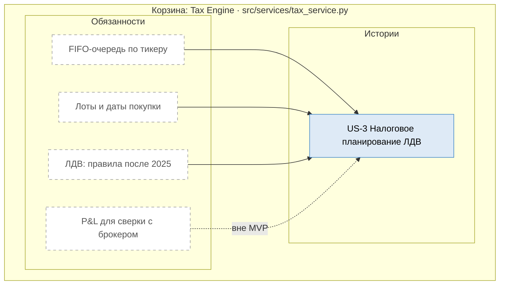

US-3 — единственная история Пользователя, которая не нужна для «пульта портфеля». Пока корзина вне MVP, US-3 выпадает из первого этапа: это надо зафиксировать в бэклоге, иначе история повисит в плане как обещание.

#### Сводка корзин

| Корзина | Обязанностей | Истории | Код | Статус |
|---|---|---|---|---|
| Portfolio Store | 6 | US-1, 2, 9, 11, 13, 16 | `src/db/` | создать |
| Portfolio Model | 5 | US-1, 2, 16 | `src/services/portfolio_service.py` | создать |
| Market Data Adapter | 6 | US-9, 12, 17 | `src/t_api/` | есть частично |
| Quote Cache | 4 | US-1, 17 | `src/db/quote_cache.py` | создать |
| Analytics | 7 | US-1, 2, 18 | `src/services/analytics_service.py` | создать |
| CLI и Presenter | 5 | US-1, 2, 9, 11, 12, 13 | `cli.py` | создать |
| Config | 4 | US-1, 9, 12, 13 | `src/config.py` | есть |
| Tax Engine | 4 | US-3 | `src/services/tax_service.py` | вне MVP |

Покрытие: из 18 историй в MVP-корзины попадают **9** — US-1, 2, 9, 11, 12, 13, 16, 17, 18. Ещё одна (US-3) ждёт Tax Engine.

**Вне корзин — 8 историй**, все по твоим исключениям:

| История | Почему вне |
|---|---|
| US-4 Сигнал о ребалансировке | Notification Service |
| US-5 Стратегия в песочнице | Strategy Engine, Risk Manager, Trade Executor |
| US-6 Подтверждение сделки | Confirm Handler, Notification Service |
| US-7 Kill switch | Trade Executor, Scheduler |
| US-8 Целевые доли | потребитель — Strategy Engine |
| US-10 Настройка расписания | Scheduler |
| US-14 Проверка лимитов | Risk Manager |
| US-15 Журналирование заявок | Trade Journal |

Ни одна из них не теряет смысла — они просто относятся к этапам 2.3 и 2.4. Диаграмма 8.5 по-прежнему описывает полную систему, эти корзины — первый этап.

---

## 6. Сценарии по акторам

### 6.1. Действия Пользователя

- **Ю1.** Посмотреть состав портфеля на дату (счёт / актив / доля)
- **Ю2.** Посмотреть динамику за период
- **Ю3.** Посмотреть FIFO по тикеру
- **Ю4.** Запустить стратегию вручную
- **Ю5.** Включить/выключить автостратегию
- **Ю6.** Подтвердить сделку
- **Ю7.** Нажать kill switch
- **Ю8.** Настроить целевые доли

### 6.2. Действия Оператора

- **О1.** Запустить backfill
- **О2.** Настроить расписание
- **О3.** Миграция схемы БД
- **О4.** Ротация токена
- **О5.** Восстановление из бэкапа

### 6.3. Действия Планировщика

- **П1.** Мониторить котировки
- **П2.** Обновлять кэш котировок
- **П3.** Делать ежедневный снимок портфеля
- **П4.** Пересчитывать метрики по расписанию

### 6.4. Действия Робота

- **Р1.** Считать лимиты (сколько денег осталось)
- **Р2.** Формировать план сделки
- **Р3.** Отправлять запрос на подтверждение
- **Р4.** Формировать и отправлять ордер
- **Р5.** Шлать информационные сигналы
- **Р6.** Писать в Trade Journal

### 6.5. Внутренние шаги (обслуживают всех)

- **В1.** Получение данных из API
- **В2.** Реконструкция портфеля на дату
- **В3.** Сохранение операций в БД
- **В4.** FIFO-очередь по тикеру
- **В5.** Учёт комиссий и налогов
- **В6.** Отображение в интерфейсе

---

## 7. Матрица: сценарий × актор × компонент

| Сценарий | Актор | Компоненты |
|---|---|---|
| Ю1. Состав портфеля | Пользователь | Portfolio Model → Analytics → Presenter |
| Ю2. Динамика | Пользователь | Portfolio Model → Analytics → Presenter |
| Ю3. FIFO по тикеру | Пользователь | Portfolio Store → Tax Engine → Presenter |
| Ю4. Запуск стратегии вручную | Пользователь | Strategy Engine → Risk → Presenter |
| Ю5. Вкл/выкл автостратегии | Пользователь | Strategy Engine (флаг) |
| Ю6. Подтверждение сделки | Пользователь | Confirm Handler → Risk → Executor |
| Ю7. Kill switch | Пользователь | Executor (стоп) + Scheduler (стоп) |
| Ю8. Настройка целевых долей | Пользователь | Config / Strategy Engine |
| О1. Backfill | Оператор | Market Data Adapter → Portfolio Store |
| О2. Настройка расписания | Оператор | Scheduler |
| О3. Миграция БД | Оператор | Portfolio Store |
| О4. Ротация токена | Оператор | Market Data Adapter |
| О5. Восстановление из бэкапа | Оператор | Portfolio Store |
| П1. Мониторинг котировок | Планировщик | Market Data Adapter → Quote Cache |
| П2. Кэш котировок | Планировщик | Quote Cache |
| П3. Снимок портфеля | Планировщик | Portfolio Model → Portfolio Store |
| П4. Пересчёт метрик | Планировщик | Analytics |
| Р1. Расчёт лимитов | Робот | Risk Manager |
| Р2. План сделки | Робот | Strategy Engine |
| Р3. Запрос подтверждения | Робот | Confirm Handler → Notification |
| Р4. Ордер | Робот | Trade Executor |
| Р5. Инфо-сигнал | Робот | Notification |
| Р6. Журнал | Робот | Trade Journal |
| В1. Данные из API | — | Market Data Adapter |
| В2. Реконструкция | — | Portfolio Model |
| В3. Сохранение в БД | — | Portfolio Store |
| В4. FIFO-очередь | — | Tax Engine |
| В5. Комиссии и налоги | — | Tax Engine |
| В6. Отображение | — | Presenter |

---

## 8. User stories по акторам

Формат: «Как <актор>, я хочу <действие>, чтобы <ценность>». Плюс критерии приёмки (AC).

### 8.1. Пользователь

**US-1. Динамика портфеля**
> Как инвестор, я хочу видеть график стоимости портфеля за период, чтобы понимать, как меняется капитал.

AC:
- переключатель периодов: 1н, 1м, 3м, 1г, всё;
- две линии: стоимость и вложенные средства;
- данные за выходные не проваливаются в ноль;
- график строится < 2 сек.

**US-2. Структура активов**
> Как инвестор, я хочу видеть доли активов по типам/секторам/валютам на дату, чтобы контролировать диверсификацию.

AC:
- выбор даты и группировки;
- stacked area chart по времени;
- сумма долей = 100%, включая кэш.

**US-3. Налоговое планирование ЛДВ**
> Как инвестор, я хочу видеть, какие лоты созрели для продажи без НДФЛ, чтобы оптимизировать налоги.

AC:
- для каждого лота хранится дата покупки;
- лоты ≥ 3 лет подсвечиваются;
- учёт правил ЛДВ после 2025 года.

**US-4. Сигнал о ребалансировке**
> Как инвестор, я хочу получать уведомление при отклонении доли актива от целевой, чтобы вовремя ребалансировать портфель.

AC:
- целевые доли в конфиге;
- порог отклонения настраивается;
- уведомление уходит в чат (Telegram/VK — мессенджер выбирается в конфиге).

**US-5. Тестирование стратегии в песочнице**
> Как инвестор, я хочу прогнать стратегию на sandbox-счёте, чтобы проверить её без риска.

AC:
- стратегия запускается только с sandbox-токеном;
- все сделки пишутся в журнал;
- kill switch останавливает робота < 5 сек.

**US-6. Подтверждение сделки**
> Как инвестор, я хочу подтверждать сделки в чате, чтобы контролировать действия робота.

AC:
- робот присылает запрос с параметрами сделки;
- без подтверждения сделка не уходит;
- таймаут подтверждения настраивается.

**US-7. Kill switch**
> Как инвестор, я хочу мгновенно остановить робота, чтобы предотвратить потери.

AC:
- команда в чате останавливает робота < 5 сек;
- активные заявки отменяются;
- событие пишется в журнал.

**US-8. Настройка целевых долей**
> Как инвестор, я хочу задавать целевые доли активов, чтобы робот ребалансировал портфель.

AC:
- доли задаются в конфиге или через интерфейс;
- сумма долей = 100%;
- изменения применяются без перезапуска.

### 8.2. Оператор

**US-9. Запуск backfill**
> Как оператор, я хочу выгрузить всю историю операций, чтобы построить аналитику.

AC:
- команда в CLI;
- 100% сверка с брокерским отчётом;
- повторный запуск не создаёт дублей.

**US-10. Настройка расписания**
> Как оператор, я хочу настраивать расписание задач, чтобы данные обновлялись автоматически.

AC:
- расписание в конфиге;
- задачи: снимок, котировки, метрики;
- ошибки логируются и шлются в чат.

**US-11. Миграция схемы БД**
> Как оператор, я хочу применять миграции, чтобы развивать схему без потери данных.

AC:
- миграции версионированы;
- бэкап перед миграцией;
- откат работает.

**US-12. Ротация токена**
> Как оператор, я хочу менять токен API, чтобы обновлять доступ.

AC:
- токен хранится вне кода;
- смена без перезапуска или с минимальным простоем;
- старый токен не пишется в логи.

**US-13. Восстановление из бэкапа**
> Как оператор, я хочу восстановить БД из бэкапа, чтобы вернуть работоспособность.

AC:
- бэкап восстанавливается < 5 минут;
- проверка целостности после восстановления.

### 8.3. Робот-исполнитель

**US-14. Проверка лимитов**
> Как робот, я хочу проверять лимиты перед сделкой, чтобы не превысить риски.

AC:
- проверка размера позиции, дневного убытка, суммы сделки;
- при отказе сделка не отправляется;
- причина отказа логируется.

**US-15. Журналирование заявок**
> Как робот, я хочу писать каждую заявку в журнал, чтобы можно было разобрать действия.

AC:
- запись: время, тикер, сторона, количество, цена, статус;
- журнал доступен для чтения;
- ошибки API тоже пишутся.

### 8.4. Планировщик

**US-16. Ежедневный снимок портфеля**
> Как планировщик, я хочу сохранять состояние портфеля раз в день, чтобы копить историю.

AC:
- снимок раз в день по расписанию;
- пропуски логируются и алертятся;
- снимок идемпотентен.

**US-17. Ежедневное обновление котировок**
> Как планировщик, я хочу обновлять котировки раз в день, чтобы данные были свежими.

AC:
- обновление по расписанию;
- кэш не дублирует запросы;
- ошибки API не ломают расписание.

**US-18. Пересчёт метрик**
> Как планировщик, я хочу пересчитывать метрики по расписанию, чтобы дашборд был актуален.

AC:
- метрики пересчитываются после снимка;
- тяжёлые расчёты не блокируют интерфейс.

### 8.5. Покрытие user stories компонентами

Какая история какими компонентами реализуется. Ребро читается как «компонент участвует в реализации истории». Источник соответствия — матрица 7, дополненная AC историй.

```mermaid
flowchart LR
    subgraph L1["Слой данных"]
        MDA["Market Data Adapter"]
        QC["Quote Cache"]
        PS[("Portfolio Store")]
    end

    subgraph L2["Доменный слой"]
        PM["Portfolio Model"]
        AN["Analytics"]
        TE["Tax Engine"]
        SE["Strategy Engine"]
        RM["Risk Manager"]
        TX["Trade Executor"]
    end

    subgraph L3["Сервисы"]
        NS["Notification Service"]
        CH["Confirm Handler"]
        TJ["Trade Journal"]
    end

    subgraph L4["Инфраструктура и конфигурация"]
        SCH["Scheduler"]
        CFG["Config"]
    end

    subgraph L5["Интерфейсы"]
        UI["CLI / Бот / Web"]
        PR["Presenter"]
    end

    subgraph A1["Пользователь"]
        US1["US-1 Динамика портфеля"]
        US2["US-2 Структура активов"]
        US3["US-3 Налоговое планирование ЛДВ"]
        US4["US-4 Сигнал о ребалансировке"]
        US5["US-5 Стратегия в песочнице"]
        US6["US-6 Подтверждение сделки"]
        US7["US-7 Kill switch"]
        US8["US-8 Целевые доли"]
    end

    subgraph A2["Оператор"]
        US9["US-9 Backfill"]
        US10["US-10 Настройка расписания"]
        US11["US-11 Миграция схемы БД"]
        US12["US-12 Ротация токена"]
        US13["US-13 Восстановление из бэкапа"]
    end

    subgraph A3["Робот-исполнитель"]
        US14["US-14 Проверка лимитов"]
        US15["US-15 Журналирование заявок"]
    end

    subgraph A4["Планировщик"]
        US16["US-16 Ежедневный снимок"]
        US17["US-17 Обновление котировок"]
        US18["US-18 Пересчёт метрик"]
    end

    %% Пользователь
    PM --> US1
    AN --> US1
    PR --> US1
    UI --> US1

    PM --> US2
    AN --> US2
    PR --> US2
    UI --> US2

    PS --> US3
    TE --> US3
    PR --> US3
    UI --> US3

    SE --> US4
    CFG --> US4
    NS --> US4

    SE --> US5
    RM --> US5
    TX --> US5
    TJ --> US5
    CFG --> US5
    UI --> US5

    CH --> US6
    NS --> US6
    RM --> US6
    TX --> US6
    UI --> US6

    TX --> US7
    SCH --> US7
    TJ --> US7
    UI --> US7

    SE --> US8
    CFG --> US8
    UI --> US8

    %% Оператор
    MDA --> US9
    PS --> US9
    UI --> US9

    SCH --> US10
    CFG --> US10
    NS --> US10
    UI --> US10

    PS --> US11
    UI --> US11

    MDA --> US12
    CFG --> US12
    UI --> US12

    PS --> US13
    UI --> US13

    %% Робот-исполнитель
    RM --> US14
    CFG --> US14

    TJ --> US15

    %% Планировщик
    PM --> US16
    PS --> US16
    SCH --> US16

    MDA --> US17
    QC --> US17
    SCH --> US17

    AN --> US18
    SCH --> US18
```

Замечания по диаграмме:

- **Analytics и Trade Journal отсутствуют в таблице 5.1**, но участвуют в матрице 7 (Ю1, Ю2, П4, Р6) и в этой диаграмме. Нужно решить: добавить их в реестр компонентов или отнести к существующим.
- **Config** — узел-заглушка: токены, расписание, целевые доли, мессенджер. В 5.4 это `src/config.py`, отдельным логическим компонентом не объявлен.
- Слой данных не связан с историями напрямую, кроме `Portfolio Store`: истории работают с реконструированным состоянием, а не с сырыми ответами API. Исключение — О1, О4, П1, где история про сам Adapter.
- Рёбра `UI` показывают точку входа, а не логику: интерфейс не должен содержать расчётов.

---

## 9. Источники: контракты интеграции

Для источников (Брокер, Внешние данные) user stories не пишутся. Вместо них — контракты.

### 9.1. Брокер (T-Bank Invest API)

- Метод `getOperationsByCursor` — выгрузка истории операций.
- Метод `GetCandles` — исторические свечи.
- Метод `postOrder` — выставление заявок (только sandbox на старте).
- Rate limits — обязательное кэширование.
- ID операций могут меняться — не использовать как первичный ключ без оговорок.

### 9.2. Внешние данные

- Курсы валют — для приведения мультивалютного портфеля к рублю.
- Индексы (IMOEX / RTS) — для сравнения с бенчмарком.
- Периодичность обновления — раз в день.

---

## 10. Ключевые архитектурные правила

1. **Зависимости только снизу вверх.** Ядро не знает про интерфейсы.
2. **Ядро отдельно от интерфейсов.** CLI, бот и веб — разные «морды» над одной библиотекой.
3. **Executor — единственный, кто пишет в API.** Adapter — только читает.
4. **Risk стоит между Strategy и Executor.** Обойти нельзя.
5. **Проверка лимитов и выставление ордеров — разные компоненты.**
6. **Уведомление и подтверждение — разные компоненты.**
7. **Пользователь и Оператор — один человек в двух ролях.** Разные интерфейсы: бот/веб и CLI.
8. **Планировщик и Робот — разные ветви Системы.** Разные последствия ошибок.
9. **Брокер и Внешние данные — источники, не акторы.** Работаем через контракты.
10. **Базовый компонент — Portfolio Store.** Все остальное — производное.

---

## 11. Что осталось уточнить

- **Контракты компонентов** — расписать входы/выходы и структуры данных для Portfolio Store и Portfolio Model.
- **Схема БД** — финализировать таблицы `operations`, `snapshots`, `prices`, `accounts`.
- **Модуль налогов** — детализировать FIFO и ЛДВ, включая правила после 2025 года.
- **Risk Manager** — конкретные лимиты: размер позиции, дневной убыток, сумма сделки.
- **Мониторинг** — что и куда алертится, какие health-check’и.
- **Развёртывание** — где запускается (локально, Raspberry Pi, VPS), как деплоится.

---

## 12. Следующие шаги

1. Расписать контракты `Portfolio Store` и `Portfolio Model`.
2. Финализировать схему БД.
3. Сформулировать критерии приёмки по всем US.
4. Собрать матрицу «сценарий × компонент × US».
5. Начать с US-1 (динамика портфеля) как первой вертикали.